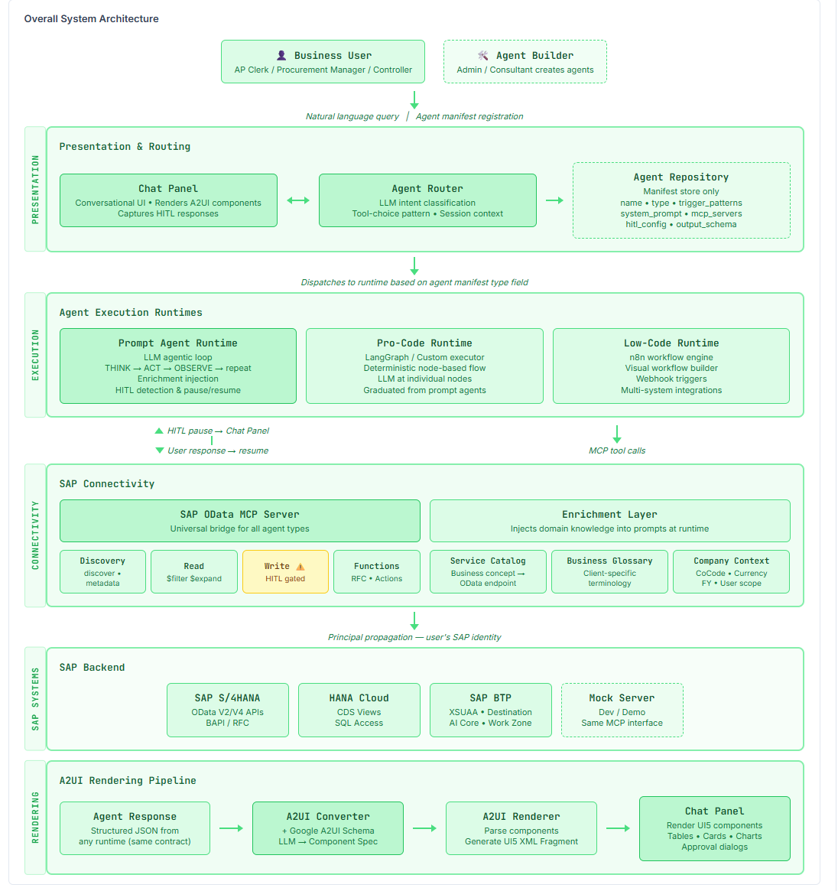
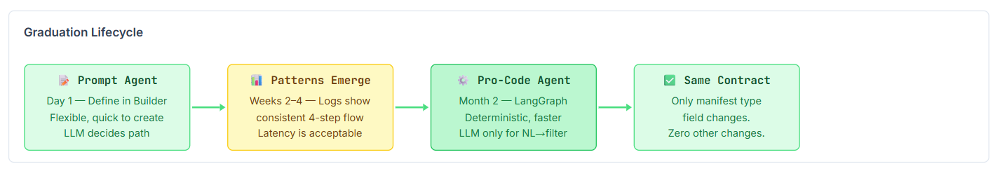
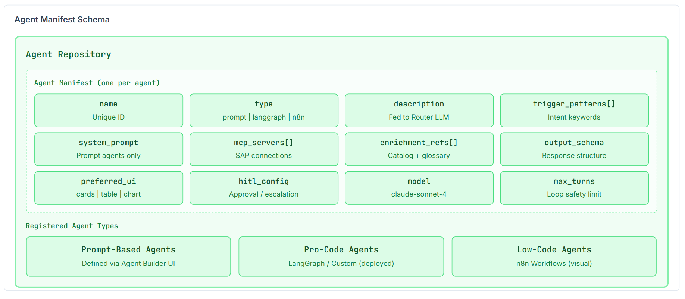
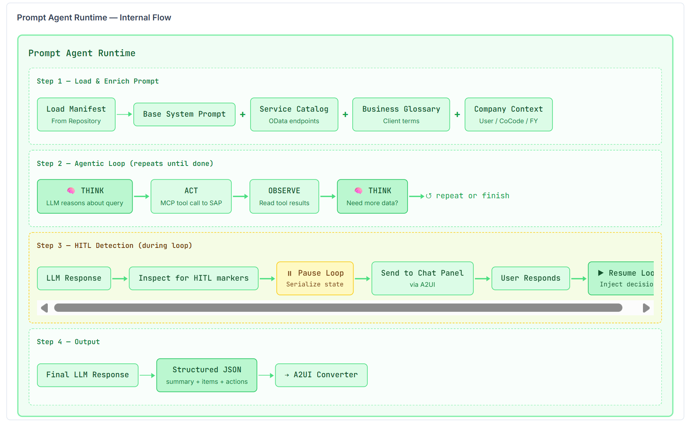
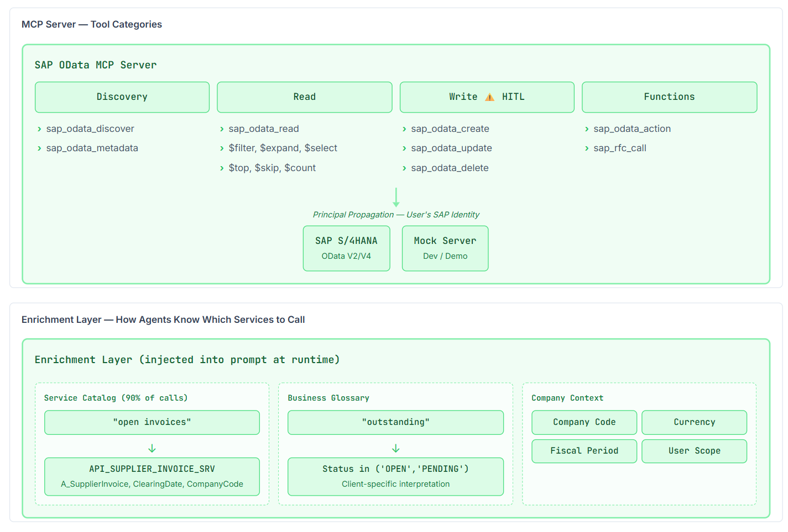
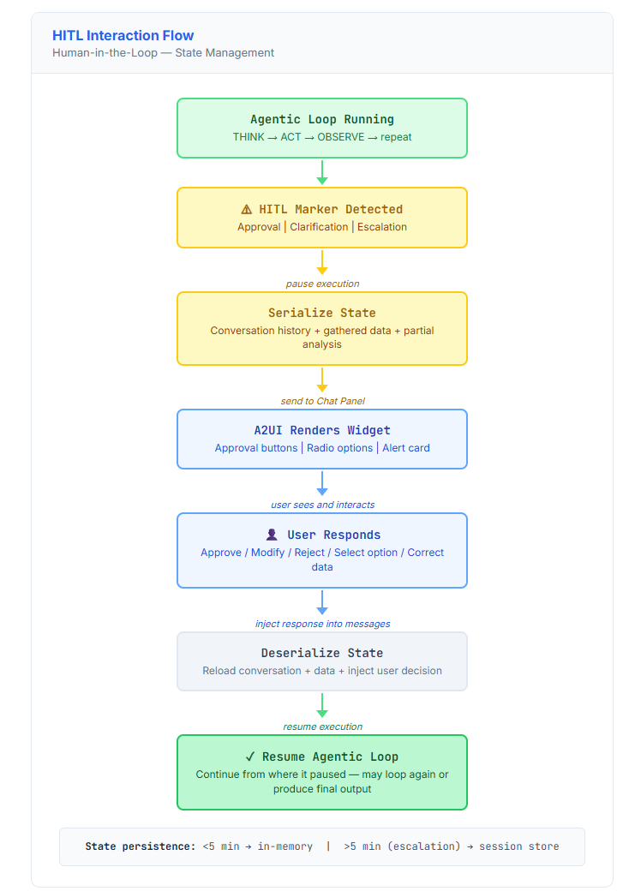
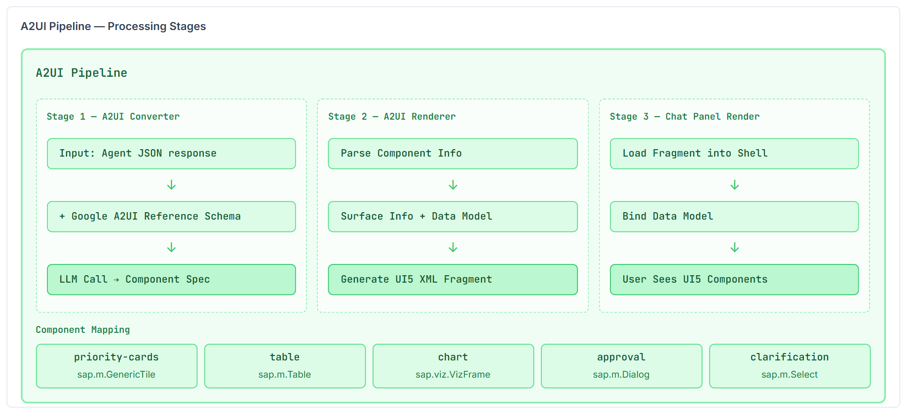
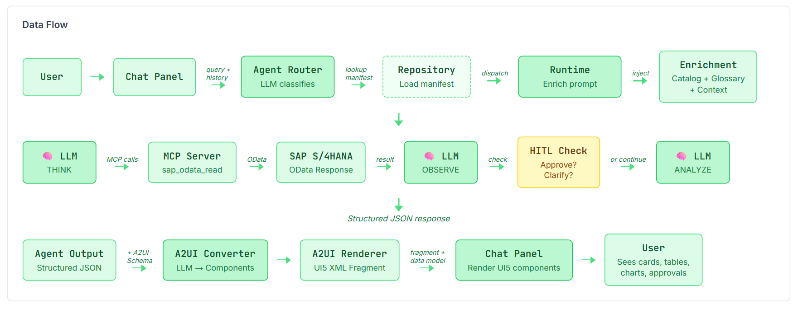
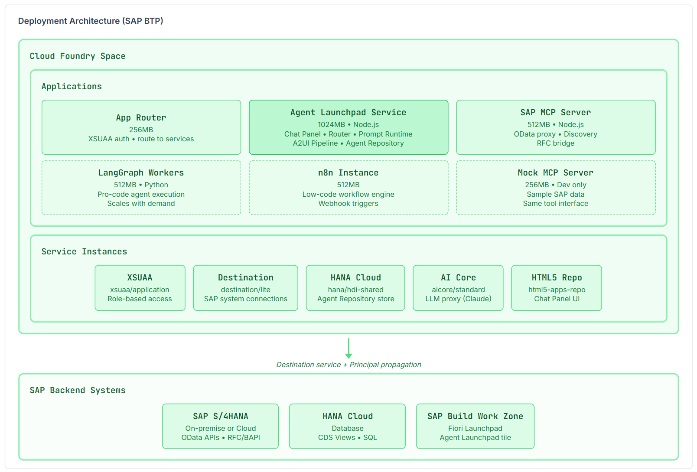

# MOSAIC — Product Requirements Document

**Multi-agent Orchestration for SAP AI-powered Conversations**

| Field | Value |
|---|---|
| Version | 1.0 |
| Date | February 2026 |
| Author | Aarini Consulting |
| Status | Draft |
| Audience | Project Managers, Stakeholders, Business Analysts |

---

## 1. Executive Summary

MOSAIC (Multi-agent Orchestration for SAP AI-powered Conversations) is an AI-powered platform that enables business users to interact with SAP systems through natural language. Instead of navigating complex SAP transactions, users converse with specialized AI agents that retrieve data, analyze business situations, and provide actionable recommendations rendered as dynamic SAP UI5 interfaces.

The platform supports three categories of agents: 

1. Prompt-based agents defined through natural language instructions and executed by LLM models at runtime, 
2. Specialized pro-code agents built with frameworks like LangGraph for deterministic workflows, and 
3. Low-code agents built with tools like n8n for integration-heavy scenarios. 

All agents share a unified manifest contract, routing mechanism, and rendering pipeline.

MOSAIC transforms SAP from a transaction-driven system into a conversation-driven advisory platform — where an AP clerk can ask "Which vendors should I prioritize paying this week?" and receive a data-backed, prioritized recommendation within seconds.

---

## 2. Problem Statement

Business users working with SAP systems face significant productivity challenges. Accounts payable clerks manually cross-reference multiple SAP transactions (FBL1N, ME2M, XK03) to make payment decisions — a process that takes hours and misses optimization opportunities. Procurement managers lack a single view that combines supply risk, vendor relationships, and financial exposure. Controllers spend days compiling variance analyses that require data from dozens of cost centers.

These tasks share common characteristics: they require data from multiple SAP sources, they benefit from analytical reasoning and prioritization, and they produce recommendations that need human judgment before action. Current solutions are either fully manual (spreadsheets and tribal knowledge) or fully automated (rigid batch programs that cannot adapt to context).

MOSAIC fills this gap by providing AI agents that combine data retrieval, analytical reasoning, and human-in-the-loop checkpoints — delivering the flexibility of manual analysis with the speed and consistency of automation.

---

## 3. Business Objectives

MOSAIC aims to achieve the following business outcomes:

- Reduce time spent on multi-source SAP data analysis from hours to minutes by having AI agents gather and synthesize data automatically.
- Capture financial optimization opportunities (cash discounts, penalty avoidance, inventory rebalancing) that are missed in manual processes.
- Enable non-technical business users to access SAP insights through natural language without learning transaction codes or report builders.
- Provide a platform for rapid creation of new AI agents — a business analyst can define a new agent in hours, not weeks.
- Maintain full auditability and human control through HITL (human-in-the-loop) checkpoints that ensure no automated action impacts SAP without explicit approval.

---

## 4. System Architecture Overview

MOSAIC is built on a five-layer architecture. Each layer has distinct responsibilities, and the design ensures that the routing, rendering, and connectivity layers are entirely agent-type-agnostic.

### 4.1 Architecture Layers

| Layer | Components | Responsibility |
|---|---|---|
| **Presentation** | Chat Panel | User-facing conversational interface. Accepts natural language, renders A2UI components, captures HITL responses. |
| **Routing** | Agent Router | LLM-based intent classifier. Matches user queries to registered agents using manifest metadata. Functions as tool-choice selection. |
| **Registry** | Agent Repository | Central store of agent manifests. Contains metadata, prompts, MCP configurations, and output schemas. No execution logic. |
| **Execution** | Agent Runtimes | Type-specific runtimes: Prompt Agent Runtime (LLM agentic loop), LangGraph executor, n8n workflow engine. |
| **Connectivity** | SAP MCP Server, Enrichment Layer | Bridges agents to SAP systems via MCP tools. Enrichment injects domain knowledge into prompts at runtime. |
| **Rendering** | A2UI Pipeline | Converts structured agent output into UI5 fragments using Google A2UI reference schema and LLM-based component generation. |

### 4.2 Agent Types

| Type | Definition | Runtime | Best For | Creation Time |
|---|---|---|---|---|
| **Prompt Agent** | System prompt + MCP servers + output schema | Prompt Agent Runtime (LLM agentic loop) | Data retrieval, analysis, recommendations | Hours |
| **Pro-Code Agent** | LangGraph / custom code with defined steps | LangGraph executor or custom process | Deterministic multi-step workflows | Days to weeks |
| **Low-Code Agent** | n8n workflow with LLM nodes | n8n workflow engine | Integration-heavy scenarios, event triggers | Hours to days |

### 4.3 Design Principle: Agent Graduation

Prompt-based agents serve as rapid prototypes. When usage patterns stabilize and a prompt agent consistently follows the same execution path, it can be graduated to a pro-code agent for improved performance and predictability. The manifest contract remains identical — only the type field and runtime change. The Router, A2UI layer, and Chat Panel require zero modifications.

---

## 5. Agent Repository

The Agent Repository is purely a manifest store. It contains no execution logic. Each registered agent is described by a manifest that provides the Router with enough information to match user intent, and the appropriate Runtime with enough configuration to execute the agent.

### 5.1 Manifest Structure

| Field | Description | Used By |
|---|---|---|
| `name` | Unique agent identifier | Router, Runtime, Logging |
| `display_name` | Human-readable name shown in UI | Chat Panel |
| `type` | Agent type: `prompt-agent`, `langgraph`, `n8n` | Router (runtime selection) |
| `description` | What this agent does (fed to Router LLM) | Router LLM for intent matching |
| `trigger_patterns` | Keywords and phrases that activate this agent | Router LLM for matching |
| `system_prompt` | Full prompt defining agent behavior (prompt agents only) | Prompt Agent Runtime |
| `mcp_servers` | MCP server connections required | Runtime (tool connections) |
| `enrichment_refs` | References to enrichment data injected at runtime | Enrichment Layer |
| `output_schema` | Expected response structure | A2UI Converter |
| `preferred_ui` | Suggested UI component type (table, cards, chart) | A2UI Converter |
| `hitl_config` | Human-in-the-loop configuration | Runtime, Chat Panel |
| `model` | LLM model to use | Prompt Agent Runtime |
| `max_turns` | Maximum agentic loop iterations | Runtime (safety limit) |

### 5.2 Agent Registration

Agents are registered in two ways. Through the Agent Builder UI, where a business analyst or consultant defines a prompt-based agent by filling in manifest fields, writing the system prompt, selecting MCP servers, and configuring HITL rules. Alternatively, pro-code agents are registered programmatically by deploying code and registering the manifest via API.

---

## 6. Agent Router

The Agent Router is the intelligence layer connecting user queries to the right agent. It operates as an LLM-based intent classifier, analogous to tool-choice selection in function calling.

### 6.1 Routing Mechanism

When a user submits a query through the Chat Panel, the Router executes an LLM call with: the user's message, the list of all registered agent manifests (name, description, trigger_patterns only — not the full system prompt), and conversation history for context.

The LLM classifies intent and returns one of three outcomes: a single agent match, a multi-agent match (sequential or parallel execution), or no match (handled as general LLM conversation).

### 6.2 Routing Modes

| Mode | Behavior | Example |
|---|---|---|
| **Explicit** | User uses slash command. Router bypasses classification. | `/po-agent list open POs` |
| **Implicit** | Natural language query. Router LLM classifies intent. | "Which vendors should I pay this week?" |
| **Composite** | Query spans multiple agents. Creates execution plan. | "Check if our PO suppliers are DPP compliant" |
| **Fallback** | No agent matches. Handled as general LLM call. | "What is the weather today?" |

### 6.3 Session Context

The Router maintains conversation history within a session. Follow-up queries route to the same agent without re-classifying. "What about company code 2000?" after a vendor payment question routes to the same Vendor Payment Agent with additional context.

---

## 7. Prompt-Based Agent Design

### 7.1 How a Prompt Agent Executes

A prompt agent is not a program. It is an LLM model given a system prompt that defines its role, connected to MCP tools that give it SAP data access, and placed in an agentic loop. The execution is dynamic — the same agent might execute 4 tool calls for a simple query or 12 for a complex one.

### 7.2 The Agentic Loop

1. **Initialize:** Load manifest. Build enriched prompt (base prompt + Service Catalog + Business Glossary + Company Context). Establish MCP connections.
2. **First LLM call:** Send enriched prompt + user query. LLM reasons about what data it needs and returns MCP tool calls.
3. **Execute tools:** Runtime executes MCP calls against SAP. Results returned to LLM.
4. **Subsequent LLM calls:** LLM reviews data, requests more if needed, or produces final response.
5. **Loop termination:** Ends when LLM produces response with no tool calls, max turns reached, or HITL checkpoint triggered.
6. **Output:** Final response passed to A2UI pipeline.

### 7.3 Prompt Enrichment Layer

Raw prompts lack knowledge of specific SAP service endpoints, client business rules, and organizational context. The enrichment layer resolves this by injecting contextual data before the first LLM call.

| Enrichment Source | Purpose | Scope |
|---|---|---|
| **Service Catalog** | Maps business concepts to OData endpoints, entities, fields, filters | Per client landscape, shared across all agents |
| **Business Glossary** | Defines client-specific terminology | Per client |
| **Company Context** | User's company code, currency, fiscal period, authorization scope | Per session (from authenticated user) |

### 7.4 How Agents Know Which OData Services to Call

The primary mechanism is the Service Catalog injected by the enrichment layer — a curated, client-specific mapping of business domains to OData service details. For 90% of interactions, the LLM reads the catalog and selects the correct service.

As a fallback, the SAP OData MCP server exposes a discovery tool. The agent can ask "what services are available for accounts payable?" and receive available endpoints. Additionally, a metadata tool returns parsed $metadata for dynamic schema understanding.

---

## 8. Human-in-the-Loop Design

HITL is the mechanism by which agents pause execution, present intermediate results to the user, and wait for confirmation before proceeding. This is critical for business scenarios with financial, operational, or compliance consequences.

### 8.1 HITL Patterns

| Pattern | When Used | Agent Behavior | UI Rendered | Resume Action |
|---|---|---|---|---|
| **Approval Gate** | Write operations, amounts above threshold | Pauses loop, presents proposed action with impact | Card with Approve / Modify / Reject buttons | User clicks → decision injected → loop continues |
| **Clarification** | Ambiguous query, missing parameters | Asks user to choose between options | Radio buttons / dropdown | Selection injected as user message |
| **Progressive Disclosure** | Large result sets, layered analysis | Returns summary; details on demand | Collapsible panels / master-detail | Click to expand or trigger follow-up call |
| **Correction Loop** | User has info agent doesn't | Accepts corrections, re-runs analysis | Inline editable cards with dropdowns | Corrections sent as new message → re-analyze |
| **Escalation** | Amount thresholds, data anomalies | Flags item, stops for human decision | Alert card with Notify Manager button | External notification (email/Teams/workflow) |

> **Architecture Diagram Reference:** See `sap-agent-launchpad-architecture-v2.html` — "Human-in-the-Loop Patterns" section for the detailed interaction flows showing pause/resume mechanics and state management.

### 8.2 HITL Configuration

Each agent manifest includes `hitl_config` with parameters: `require_approval` (boolean), `approval_threshold` (currency amount), `allow_corrections` (boolean), `escalation_rules` (conditions and actions), `clarification_mode` ("options" or "freetext"), `progressive_detail` (boolean), and `max_auto_actions` (safety limit).

### 8.3 State Management

When the loop pauses for HITL, the Runtime serializes agent state (conversation history + gathered data + partial analysis). Short waits (under 5 minutes) use in-memory state. Longer waits (escalation to a manager) persist to a session store.

---

## 9. A2UI Rendering Pipeline

The Adaptive UI pipeline transforms structured agent output into SAP UI5 visual components rendered within the Chat Panel. It operates identically regardless of agent type.

### 9.1 Pipeline Stages

| Stage | Input | Process | Output |
|---|---|---|---|
| **Parse** | Agent response (structured JSON) | A2UI Converter identifies data shape and preferred_ui hint | Surface information and data model |
| **Map** | Surface info + Google A2UI Reference Schema | LLM call generates component specification | Component specification |
| **Render** | Component spec + data model | A2UI Renderer generates UI5 XML fragment | UI5 fragment displayed in Chat Panel |

### 9.2 Component Mapping

| Agent Output Type | UI5 Component |
|---|---|
| `priority-cards` | sap.m.GenericTile + sap.m.ObjectStatus |
| `table` | sap.m.Table + sap.m.Column |
| `chart` | sap.viz.ui5.controls.VizFrame |
| `form` | sap.ui.layout.form.SimpleForm |
| `approval` | sap.m.Dialog + sap.m.Button |
| `clarification` | sap.m.RadioButtonGroup / sap.m.Select |

---

## 10. SAP MCP Server

The SAP MCP Server bridges agents to SAP systems. A single MCP server instance serves all agents for a given SAP landscape.

### 10.1 Tool Categories

| Category | Tools | Purpose |
|---|---|---|
| **Discovery** | `sap_odata_discover`, `sap_odata_metadata` | Agents discover available services and schemas at runtime |
| **Read** | `sap_odata_read`, `sap_odata_query` | Retrieve data via OData GET with $filter, $expand, $select |
| **Write** | `sap_odata_create`, `sap_odata_update`, `sap_odata_delete` | Modify SAP data — always gated by HITL approval |
| **Functions** | `sap_odata_action`, `sap_rfc_call` | Execute SAP actions and RFC/BAPI calls |

### 10.2 Authentication

The MCP server authenticates to SAP using principal propagation — the connected user's identity. Agents can only access data the user is authorized for in SAP. Authorization errors are communicated to the user in plain language.

### 10.3 Mock Server

A mock SAP MCP server returns realistic sample data for development and demonstrations without live SAP connectivity. It implements the same tool interface, making it transparent to agents.

---

## 11. Security and Governance

### 11.1 Data Access Control

All SAP data access flows through the MCP server using the authenticated user's principal. Agents inherit SAP's authorization model — no additional access control layer is needed.

### 11.2 Agent Governance

- All agent executions are logged with timestamp, user, agent name, query, tool calls, data accessed, HITL interactions, and final output.
- Agent definitions are managed by authorized consultants or administrators through the Agent Builder — not by end users.
- Write operations are always gated by HITL approval unless explicitly configured otherwise by an administrator.
- Agent manifests include version fields. Changes create new versions with rollback capability.

### 11.3 Prompt Security

The Runtime separates the system prompt (injected by Runtime, never shown to user) from the user message. User input is always in the user role, never concatenated into the system prompt. The prompt includes instructions to ignore any instructions embedded within MCP tool results.

---

## 12. Reference Implementation: Vendor Payment Risk Agent

### 12.1 Business Problem

AP teams process hundreds of open invoices weekly. Payment prioritization relies on manual cross-referencing of multiple SAP transactions combined with tribal knowledge. This process takes hours, is error-prone, and misses cash discount opportunities.

### 12.2 Agent Behavior

The agent accepts a natural language question about payment priorities and an optional budget constraint. It retrieves open invoices, vendor master data, purchase order dependencies, and quality notifications from S/4HANA via MCP. It reasons across five dimensions: cash discount opportunities, supply criticality, late payment penalty exposure, vendor relationship health, and aging severity. It produces a prioritized recommendation with four action categories: Pay Now, Pay This Week, Can Wait, and Hold.

### 12.3 HITL Application

- **Clarification:** Asks which company code(s) to analyze if multiple are available.
- **Progressive Disclosure:** Summary with vendor cards; drill-down for invoice-level detail.
- **Correction Loop:** Users override vendor actions with reasons; agent recalculates allocation.

### 12.4 Example Interaction

A user asks: "Which vendors should I prioritize paying this week? Budget is around €400K."

The agent retrieves data, analyzes 34 vendors across five risk dimensions, and responds:

- **Summary:** €1.2M open payables, recommending €387K this week — capturing €23K in discounts, avoiding €8K in penalties
- **Pay Now:** Müller Chemicals (€145K, sole-source risk), TechParts GmbH (€89K, discount expiring), Schneider Logistics (€62K, 94 days overdue with penalty)
- **Pay This Week:** Jansen Packaging (€91K, discount expiring Monday)
- **Can Wait:** Berg Metals and 18 others (all under 30 days, no urgency)
- **Hold:** FreshPack Ltd (€28K, open quality disputes)

---

## 13. Additional Prompt Agent Candidates

| Agent | Business Scenario | Key HITL Pattern |
|---|---|---|
| **PO Status Advisor** | Purchasing teams track open POs, delivery delays, GR/IR discrepancies | Progressive Disclosure, Correction Loop |
| **DPP Compliance Checker** | Validates product data against EU Digital Product Passport requirements | Approval Gate, Escalation |
| **Inventory Rebalancer** | Redistribute stock across plants based on demand, stock, and transit times | Approval Gate, Clarification |
| **Customer Credit Reviewer** | Assess payment behavior, credit exposure, dispute history for credit limit adjustments | Escalation, Approval Gate |
| **Budget Variance Analyst** | Review actual vs. planned spending; identify variances and root causes | Progressive Disclosure, Clarification |
| **Contract Renewal Advisor** | Review expiring contracts, compare with benchmarks, recommend action | Approval Gate, Correction Loop |
| **Transport Impact Analyzer** | Assess risk of releasing SAP transports — collision risk, dependency chain, blast radius | Progressive Disclosure, Escalation |

---

## 14. Deployment Architecture

> **Architecture Diagram Reference:** 

MOSAIC deploys on SAP BTP Cloud Foundry with the following components:

| Component | Memory | Technology | Purpose |
|---|---|---|---|
| App Router | 256MB | Node.js | XSUAA auth, route to services |
| MOSAIC Service | 1024MB | Node.js | Chat Panel, Router, Prompt Runtime, A2UI Pipeline, Repository |
| SAP MCP Server | 512MB | Node.js | OData proxy, discovery, RFC bridge |
| LangGraph Workers | 512MB | Python | Pro-code agent execution |
| n8n Instance | 512MB | Node.js | Low-code workflow engine |

### BTP Service Instances

| Service | Plan | Purpose |
|---|---|---|
| XSUAA | xsuaa/application | Authentication, role-based access |
| Destination | destination/lite | SAP system connections |
| HANA Cloud | hana/hdi-shared | Agent Repository persistence |
| AI Core | aicore/standard | LLM proxy (Claude) |
| HTML5 Repo | html5-apps-repo | Chat Panel UI hosting |

---

## 15. Glossary

| Term | Definition |
|---|---|
| **A2UI** | Adaptive UI — pipeline that converts structured agent output into SAP UI5 components |
| **Agentic Loop** | The think-act-observe cycle that prompt agents execute: reason → call tools → read results → repeat |
| **Agent Manifest** | YAML/JSON definition that describes an agent's identity, capabilities, tools, and HITL rules |
| **Enrichment Layer** | Runtime injection of domain knowledge (service catalog, glossary, context) into agent prompts |
| **HITL** | Human-in-the-Loop — mechanism for agents to pause and request human judgment |
| **LangGraph** | Python framework for building stateful, deterministic agent workflows with defined nodes and edges |
| **MCP** | Model Context Protocol — standard for connecting LLMs to external tools and data sources |
| **MOSAIC** | Multi-agent Orchestration for SAP AI-powered Conversations |
| **n8n** | Open-source workflow automation platform used for low-code agent definitions |
| **Principal Propagation** | Authentication pattern where the agent uses the logged-in user's SAP identity |
| **Prompt Agent** | Agent defined entirely by a system prompt and MCP tool connections, executed by an LLM agentic loop |
| **Service Catalog** | Client-specific mapping of business concepts to SAP OData service endpoints |